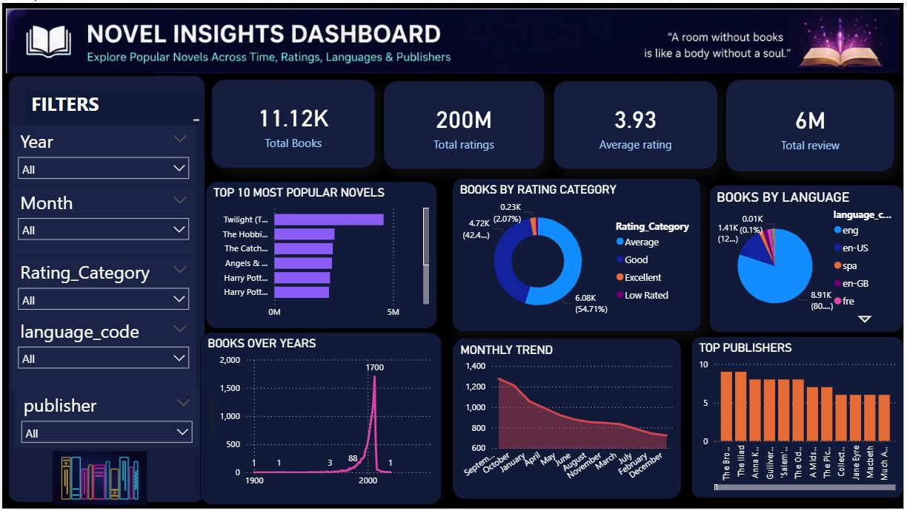
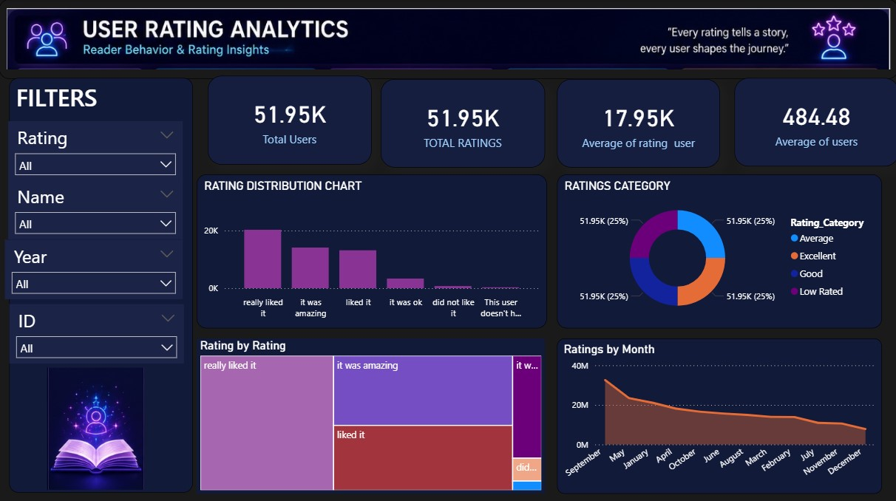

# 📚 Novel Analysis Dashboard using Power BI

## 📌 Project Overview
This project is an interactive Power BI dashboard created using Goodreads datasets.  
The dashboard provides insights into novel popularity, ratings, reviews, languages, publishers, and user behavior.

The project focuses on:
- Data Cleaning
- Data Transformation
- DAX Calculations
- Dashboard Design
- User Analytics
- Data Visualization

---

## 📊 Features

### Novel Insights Dashboard
- Total Books
- Average Ratings
- Total Reviews
- Top 10 Popular Novels
- Books by Language
- Books by Rating Category
- Monthly Trends
- Top Publishers
- Books Over Years

### User Rating Analytics
- User Rating Distribution
- Rating Categories
- Rating Trends
- Reader Behavior Insights

---

## 🛠 Tools & Technologies
- Power BI
- Power Query
- DAX
- Goodreads Dataset
- Data Visualization

---

## 📂 Dataset Used

### Goodreads Books Dataset
https://www.kaggle.com/datasets/jealousleopard/goodreadsbooks

### Goodreads Reviews Dataset
https://www.kaggle.com/datasets/bahramjannesarr/goodreads-book-datasets-10m

---

## 🧹 Data Cleaning Process
- Removed blank rows
- Removed duplicate books
- Handled null values
- Created Year and Month columns
- Created Rating Categories using DAX

---

## 📈 Dashboard Highlights
- Dark premium dashboard design
- Interactive slicers
- KPI cards
- Trend analysis
- Reader behavior analysis

---

## 📸 Dashboard Preview

### Novel Insights Dashboard

### User Rating Analytics

---

## 🚀 Learning Outcomes
Through this project, I learned:
- Power BI dashboard development
- Data transformation using Power Query
- DAX calculations
- Visual storytelling
- Dashboard UI/UX design

---

## 👨‍💻 Author
Harsha sree
B.Tech CSE Student# Novel-Analysis-PowerBI-Dashboard
